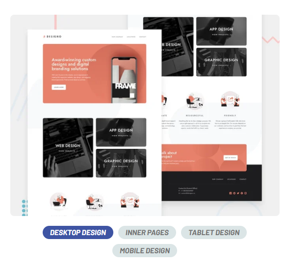

# Frontend Mentor - Designo multi-page website



## **About Designo multi-page website**

Designo is a design agency that offers creative services for both individuals and businesses. The website showcases their web and graphic design projects, aiming to bring client ideas to life with innovative design and development.

This multi-page website highlights Designo's services in a simple, easy-to-navigate platform. With elegant design, smooth transitions, and user-friendly navigation, the site ensures a great experience for visitors.

## **Features**

- **Multiple Pages:** The website includes dedicated pages for About, Services, Portfolio,
  and Contact to provide detailed information about the agency and its offerings.
- **Responsive Design:** Fully optimized for all devices, ensuring a seamless experience across mobile, tablet, and desktop screens
- **Smooth Navigation:** An intuitive and user-friendly navigation structure for easy exploration of the site and its content.
- **Portfolio Gallery:** A showcase of previous design projects, complete with hover effects and interactive elements to engage visitors.
- **Contact Form:** A simple, user-friendly form for potential clients to easily reach out and get in touch with the agency.

## **Technologies Used**

- **React**: For building the user interface.
- **TypeScript**: For type safety and better code maintainability.
- **Bootstrap**: For styling.
- **SCSS**: For enhanced CSS styling.
- **Next.js:**: For server-side rendering, ensuring faster loading.
- **React Hook Form**: For handling form submissions and validation with minimal re-renders.
- **Zod**: For schema validation and type-safe form handling.

## **Setup and Installation**

### Prerequisites

- Node.js installed on your system.
- Basic knowledge of npm.

1. Clone the repository:

   ```bash
   https://github.com/IvanPejcinoski1/Designo_multiPage_webiste_FrontEndMentor.git

   ```

2. Navigate to the project directory: cd designo_website
3. Install dependencies: npm install
4. Start the development server:npm run dev
5. Visit http://localhost:3000 in your browser to see the website in action.
